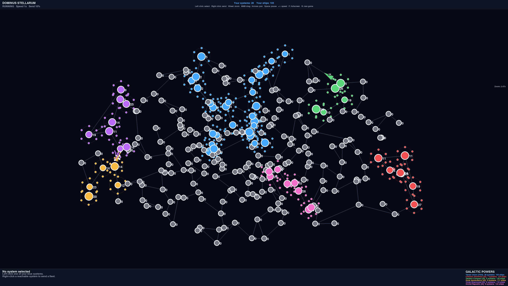

# Dominus Stellarum

A real-time 4X space strategy game built with Python and pygame. Expand your empire across a procedurally generated galaxy, send fleets along hyperlanes, defeat rival empires, and become the last surviving power.



## Requirements

- Python 3.10 or newer recommended
- pygame

## Installation

Clone the repository and enter the project directory:

```bash
git clone https://github.com/hermonochy/Dominus-Stellarum.git
cd Dominus-Stellarum
```

Create and activate a virtual environment:

### Windows

```bash
python -m venv .venv
.venv\Scripts\activate
```

### macOS/Linux

```bash
python3 -m venv .venv
source .venv/bin/activate
```

Install the dependencies:

```bash
pip install -r requirements.txt
```

## Running the game

Start the game with:

```bash
python main.py
```

On systems where Python is invoked as `python3`, use:

```bash
python3 main.py
```

## How to play

You begin with one controlled star system. Owned systems continuously produce ships. Use those ships to reinforce your territory or attack neighboring systems.

### Fleet orders

1. **Left-click** one of your systems to select it.
2. **Right-click** a different system to send a fleet.
3. Fleets can only travel along displayed hyperlanes.
4. Capturing all rival territory makes you the winner.

### Controls

| Action | Control |
| --- | --- |
| Select one of your systems | Left mouse button |
| Send a fleet to a neighboring system | Right mouse button |
| Increase/decrease fleet send percentage | Mouse wheel |
| Set fleet size to 25% | `1` |
| Set fleet size to 50% | `2` |
| Set fleet size to 75% | `3` |
| Set fleet size to 100% | `4` |
| Pause or resume the simulation | `Space` |
| Increase simulation speed | `+` or `=` |
| Decrease simulation speed | `-` |
| Start a new game | `R` |
| Quit | `Esc` |

## Configuration

Gameplay and display settings can be adjusted in [`game/config.py`](game/config.py), including:

- Frame rate
- Number of star systems and empires
- Star spacing and hyperlane generation
- Starting ship counts
- Production rates
- Fleet speed
- AI decision intervals and attack thresholds
- Simulation speed options
- Empire names and colors